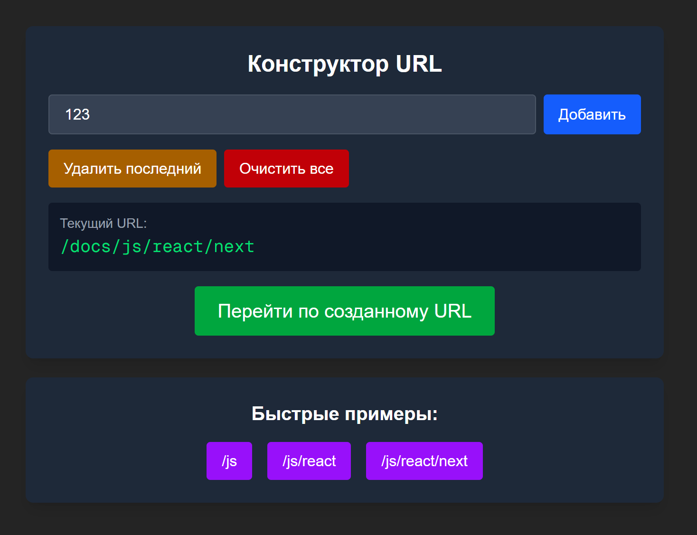

# 🚀 Маршрутизация и роутинг в Next.js

<div align="center">


_Демонстрация системы маршрутизации Next.js_

</div>

## 🚀 Быстрый старт

//

## 📋 Оглавление

- [Вложенная маршрутизация](#-вложенная-маршрутизация-static-routes)
- [Динамические маршруты](#-динамические-маршруты-dynamic-routes)
- [Вложенные динамические маршруты](#-вложенные-динамические-маршруты-dynamic-nested-routes)
- [Перехватывающие маршруты](#-перехватывающие-маршруты-catch-all-segments)
- [Технологии](#-технологии)

## 🏗️ Вложенная маршрутизация (Static Routes)

**Раздел "Блог"** демонстрирует быструю статическую навигацию по предопределенным страницам.

### 🎯 Структура URL

```
/blog                  # Родительский маршрут
/blog/first            # Статическая страница 1
/blog/second           # Статическая страница 2
```

### 📁 Структура файлов

```
app/
├── blog/
│   ├── page.tsx               # /blog - главная страница блога
│   ├── first/
│   │   └── page.tsx           # /blog/first - статья "Первый пост"
│   └── second/
│       └── page.tsx           # /blog/second - статья "Второй пост"
```

### 💡 Особенности

- **Мгновенная загрузка** - статические страницы
- **SEO-оптимизация** - предопределенные мета-теги
- **Простая навигация** - фиксированная структура

## 🔄 Динамические маршруты (Dynamic Routes)

**Раздел "Продукты"** использует ID-based навигацию для страниц с динамическим контентом.

### 🎯 Структура URL

```
/products              # Список всех товаров
/products/123          # Страница товара с ID 123
/products/456          # Страница товара с ID 456
```

### 📁 Структура файлов

```
app/
├── products/
│   ├── page.tsx               # /products - каталог товаров
│   └── [productId]/
│       └── page.tsx           # /products/[id] - карточка товара
```

### 💡 Особенности

- **Гибкость** - неограниченное количество страниц
- **Динамический контент** - данные из API/БД
- **Автоматическое связывание** - генерация URL на лету

## 🎭 Вложенные динамические маршруты (Dynamic Nested Routes)

**Раздел "Посты"** демонстрирует комбинированный подход для сложных структур с данными из внешнего API [jsonpaceholder](https://jsonplaceholder.typicode.com/)

### 🎯 Структура URL

```
/posts                         # Лента постов
/posts/1                       # Пост с ID 1
/posts/1/comments              # Все комментарии к посту 1
/posts/1/comments/5            # Конкретный комментарий 5 к посту 1
```

### 📁 Структура файлов

```
app/
├── posts/
│   ├── page.tsx               # /posts - список всех постов
│   └── [postId]/
│       ├── page.tsx           # /posts/[id] - детали поста
│       └── comments/
│           ├── page.tsx       # /posts/[id]/comments - все комментарии
│           └── [commentId]/
│               └── page.tsx   # /posts/[id]/comments/[id] - конкретный комментарий
```

### 💡 Особенности

- **Внешние данные** - интеграция с JSONPlaceholder API
- **Глубокая вложенность** - многоуровневая структура
- **Взаимосвязи** - связь между постами и комментариями

## 🌟 Перехватывающие маршруты (Catch-all Segments)

**Раздел "Документация"** представляет конструктор URL для работы с глубоко вложенными структурами произвольной глубины.

<div align="center">


_Интерактивный конструктор URL пути_

</div>

### 🎯 Структура URL

```
/docs                           # Оглавление документации
/docs/javascript               # Раздел JavaScript
/docs/javascript/react         # Подраздел React
/docs/javascript/react/next    # Подраздел Next.js
/docs/[...slug]                # Любая глубина вложенности
```

### 📁 Структура файлов

```
app/
└── docs/
    ├── page.tsx               # /docs - главная страница
    └── [...slug]/
        └── page.tsx           # /docs/[...slug] - динамический путь любой глубины
```

## 🛠 Технологии

- **Next.js 16** - App Router и современные возможности
- **TypeScript** - типобезопасность и автодополнение
- **Tailwind CSS** - современная стилизация
- **JSONPlaceholder** - демонстрационные данные API
